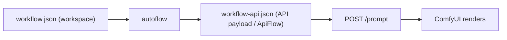
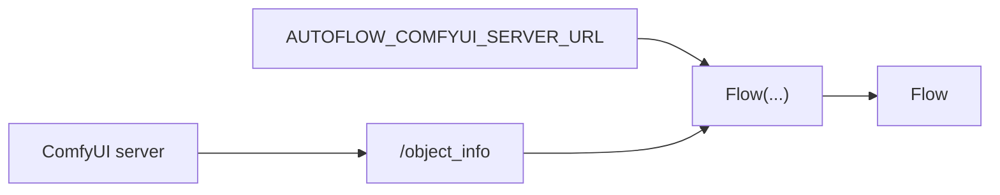
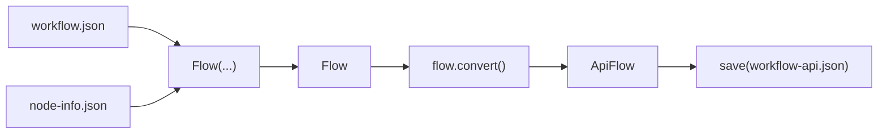
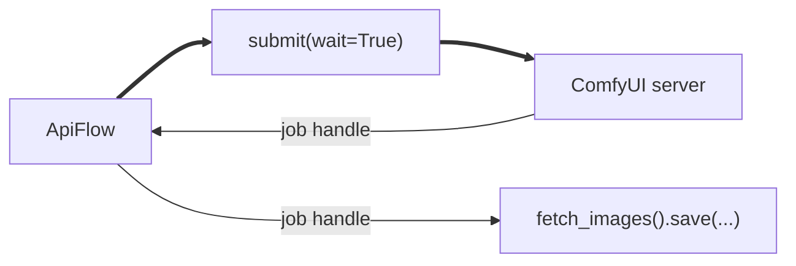

<!-- Keep version below in sync with autoflow/version.py -->
```text
ComfyUI 
 █████╗ ██╗   ██╗████████╗ ██████╗ ███████╗██╗      ██████╗ ██╗    ██╗
██╔══██╗██║   ██║╚══██╔══╝██╔═══██╗██╔════╝██║     ██╔═══██╗██║    ██║
███████║██║   ██║   ██║   ██║   ██║█████╗  ██║     ██║   ██║██║ █╗ ██║
██╔══██║██║   ██║   ██║   ██║   ██║██╔══╝  ██║     ██║   ██║██║███╗██║
██║  ██║╚██████╔╝   ██║   ╚██████╔╝██║     ███████╗╚██████╔╝╚███╔███╔╝
╚═╝  ╚═╝ ╚═════╝    ╚═╝    ╚═════╝ ╚═╝     ╚══════╝ ╚═════╝  ╚══╝╚══╝ 
                                                       version: 1.4.2
```

[](https://pypi.org/project/comfyui-autoflow/)
[](https://pypi.org/project/comfyui-autoflow/)
[](https://github.com/chrisdreid/comfyui-autoflow/blob/main/LICENSE)
[](https://github.com/chrisdreid/comfyui-autoflow)
[](https://github.com/chrisdreid/comfyui-autoflow/issues)
[](https://pypi.org/project/comfyui-autoflow/)


---
# Imagine...
### What if you could `load, edit, and submit` ComfyUI workflows without ever exporting an API workflow from the GUI?

### What if you could `batch-convert and patch workflows offline`  No running ComfyUI instance required?

### What if you could attach studio `metadata` to your workflow and have it carry through the entire production lifecycle?

### What if you could `render` comfyui node workflows with all of the above features, `without ever launching the comfyui server`?

- # Let me introduce `comfyui-autoflow`

---
# autoflow

Skip the GUI. `autoflow` handles the backend so you can automate/pipeline your ComfyUI renderables with full control through the entire conversion and submission process.
`autoflow` is a small and efficient, pure **Python package** (stdlib-only +extendable) for ComfyUI automation that gives you access to renderable conversion with or without ComfyUI.

## Features

| Feature | Description |
|---------|-------------|
| **Convert workflow.json** | `workflow.json` → renderable API payload, skip the GUI export entirely |
| **Offline / Online** | Convert without a running ComfyUI server, or fetch live from one |
| **Submit + Images** | Send to ComfyUI, wait for completion, fetch and save output images |
| **Progress** | Hook into WebSocket render events for real-time progress control |
| **Edit + Introspect** | `api.KSampler.seed = 42`, `.find(...)`, `.choices()`, `.tooltip()`. OOP access to every node and widget |
| **Metadata** | Attach studio metadata to workflows that carries through the entire production lifecycle |
| **Serverless Execute** | `.execute()` runs ComfyUI nodes in-process, no HTTP server required |
| **Map** | Sweep seeds, prompts, paths across nodes for batch pipelines |
| **Save + Load** | `.save()` / `.load()` on Flow, ApiFlow, and NodeInfo for simple serialization of any object |
| **Extract** | Load workflows directly from ComfyUI PNG outputs (embedded metadata) |
| **Stdlib-only** | Zero dependencies by default; optional Pillow, ImageMagick, ffmpeg |
| **Subgraphs** | Flattens nested `definitions.subgraphs` into a normal API payload |

## Requirements

- Python 3.7+ (dict insertion order preserved)
- ComfyUI server (optional, for API mode)
- No additional Python packages required

## Tested ComfyUI Versions:
- ComfyUI `0.8.2`
- ComfyUI_frontend `v1.35.9`

---
## The Two `ComfyUI Formats` you should know about

ComfyUI uses two JSON formats:

| Format | File | Description |
|--------|------|-------------|
| **Workspace** | `workflow.json` | The UI-editable graph with node positions, colors, widgets. What you save from ComfyUI. |
| **API Payload** | `workflow-api.json` | The renderable blueprint—just nodes + inputs, ready for `POST /prompt`. This is what `ApiFlow` represents. |

**autoflow converts Workspace → API Payload** (or loads an existing API Payload directly).



## Installation

```bash
pip install comfyui-autoflow
```

Then use with `python -m autoflow ...` or `import autoflow` from Python.
- Optional: set `AUTOFLOW_COMFYUI_SERVER_URL` once (then `server_url` / `--server-url` become optional):
  - Linux/macOS: `export AUTOFLOW_COMFYUI_SERVER_URL="http://localhost:8188"`
  - Windows PowerShell: `$env:AUTOFLOW_COMFYUI_SERVER_URL = "http://localhost:8188"`
  - Windows CMD: `set AUTOFLOW_COMFYUI_SERVER_URL=http://localhost:8188`
  - Python: `import os; os.environ["AUTOFLOW_COMFYUI_SERVER_URL"] = "http://localhost:8188"`
- Optional: set `AUTOFLOW_NODE_INFO_SOURCE=modules|fetch|server|/path/to/node-info.json` to auto-resolve `node_info`.
---
# `autoflow` - Quick Start

### Get `node-info.json` (optional, one-time)

Save `node-info.json` so you can convert offline. You can also convert against a running ComfyUI instance, but for efficiency we recommend pulling a new `node-info.json` per instance (reproducible, no server needed).


```python
# api — set AUTOFLOW_COMFYUI_SERVER_URL first (see Installation above)
from autoflow import NodeInfo

node_info = NodeInfo('fetch')
node_info.save('node-info.json')
```

```bash
# cli
python -m autoflow --download-node-info-path node-info.json
```

- Direct modules (no server): `NodeInfo.from_comfyui_modules()` builds `node_info` from local ComfyUI nodes.
- Env source (optional): set `AUTOFLOW_NODE_INFO_SOURCE=modules|fetch|server|/path/to/node-info.json`.

- More: [`docs/node-info-and-env.md`](docs/node-info-and-env.md)
## Convert live (using running ComfyUI)

Convert `workflow.json` by fetching `/object_info` from your running ComfyUI server.


If environment variable `AUTOFLOW_COMFYUI_SERVER_URL` is set, `server_url` becomes optional.

If `AUTOFLOW_NODE_INFO_SOURCE` is set, `Flow(...)` / `ApiFlow(...)` will auto-resolve `node_info` when none is provided.

```python
# api — use Flow to work with workflow.json natively
from autoflow import Flow

flow = Flow("workflow.json")   # uses AUTOFLOW_COMFYUI_SERVER_URL
flow.save("workflow-out.json") # stays in workspace format

# or convert to API payload
api = flow.convert()
api.save("workflow-api.json")
```

> **Note:** `ApiFlow("workflow.json")` also works and always converts to the API format. `Flow` keeps the workspace format and converts on demand.

```bash
# cli
python -m autoflow --input-path workflow.json --output-path workflow-api.json
```

- More: [`docs/convert.md`](docs/convert.md), [`docs/node-info-and-env.md`](docs/node-info-and-env.md)


## Convert `workflow` to `workflow-api` (offline)

Convert using your saved `node-info.json` (no server needed).



```python
# api — Flow-first: load, optionally edit, then convert
from autoflow import Flow

flow = Flow("workflow.json", node_info="node-info.json")
flow.save("workflow-out.json")       # save workspace format

api = flow.convert()                  # convert to API payload
api.save("workflow-api.json")         # save API format
```

```bash
# cli
# Offline mode (saved node_info)
python -m autoflow --input-path workflow.json --output-path workflow-api.json --node-info-path node-info.json

# Short form (flags)
python -m autoflow -i workflow.json -o workflow-api.json -f node-info.json
```

- More: [`docs/convert.md`](docs/convert.md)

## Load from PNG (extract embedded workflow)

ComfyUI embeds workflow metadata in PNG outputs. Extract it directly—no external dependencies needed.

```python
# api
from autoflow import Flow, ApiFlow

# From PNG file
api_flow = ApiFlow.load("ComfyUI_00001_.png")  # extracts API payload
flow = Flow.load("ComfyUI_00001_.png")          # extracts workspace

# From bytes (e.g., HTTP upload, database blob)
with open("output.png", "rb") as f:
    api_flow = ApiFlow.load(f.read())
```

All `.load()` methods accept: `dict`, `bytes`, `str` (JSON or path), `Path`

## Submit + images (optional)
 Submit your `ApiFlow` directly to ComfyUI and get images back


```python
# api
from autoflow import ApiFlow

api = ApiFlow("workflow.json")
api.saveimage.inputs.filename_prefix='autoflow'
res = api.submit(server_url="http://localhost:8188", wait=True)
images = res.fetch_images()
images.save("outputs/frame.###.png")
```

You can also set an output default with env `AUTOFLOW_OUTPUT_PATH` and then just provide a `filename=` template:

```python
# api
images.save(filename="frame.{src_frame}.png")  # or "frame.###.png" for zero-indexed numbering
```

```bash
# cli
# Prints prompt_id first, then (if saving) the written file paths. Progress logs go to stderr.
python -m autoflow --submit --input-path workflow.json --server-url http://localhost:8188 \
  --save-images outputs --filepattern "frame.###.png" --index-offset 1001
```

- More: [`docs/submit-and-images.md`](docs/submit-and-images.md), [`docs/progress-events.md`](docs/progress-events.md)

## Serverless execute (no ComfyUI HTTP server)

If you're running inside a ComfyUI environment (repo + venv), you can run workflows serverlessly:

- Details: [`docs/execute.md`](docs/execute.md)

## Optional Functionality

- **Polymorphic loading** (dict, bytes, JSON string, file path, PNG):
  - all `.load()` methods auto-detect input type: [`docs/load-vs-convert.md`](docs/load-vs-convert.md)
  - extract workflows from ComfyUI PNG outputs (no dependencies)
- **OOP node access**:
  - `api.KSampler.seed = 42` — attribute-style access by class_type
  - `api.find(class_type="KSampler")[0].seed = 42` — search + then edit (returns NodeProxy objects)
  - `api.KSampler._meta` / `.meta` — access node metadata
  - `api["ksampler/seed"]` — path-style access
  - `api["18:17:3/seed"] = 42` — edit nodes inside flattened subgraph exports (ComfyUI-style path IDs)
  - `flow.nodes.KSampler.type` — explicit via `.nodes` for workspace flows
  - `flow.nodes.find(title="NewSubgraphName")[0].path()` — find renamed subgraph instances; prints a stable path like `18:17:3`
  - `flow.extra.ds.scale` — drill into nested dicts with `DictView`
  - `node.properties.models.url` — single-item list-of-dicts drill via `ListView` (otherwise index first)
  - **Widget-value repr**: `NodeRef`/`NodeSet` display widget values as dicts — `f.nodes.CheckpointLoaderSimple` → `{'nodes.CheckpointLoaderSimple[0]': {'ckpt_name': '...'}}`
  - **Widget introspection**: `.choices()` returns valid combo options, `.tooltip()` shows help text, `.spec()` gives the raw `node_info` spec
  - **Tab completion**: curated `__dir__` on `ApiFlow`, `NodeSet`, `FlowTreeNodesView`, and `WidgetValue` — only shows user-facing attrs
  - **Indexed nodes**: standard Python REPL can't tab-complete `api.KSampler[0].<tab>` — assign to a variable first: `k = api.KSampler[0]` then `k.<tab>`
- **Mapping** (seeds/paths/prompts):
  - typed callback mapping: [`docs/mapping.md`](docs/mapping.md)
  - declarative string/path mapping: [`docs/map-strings-and-paths.md`](docs/map-strings-and-paths.md)
  - cache-busting repeat runs: [`docs/force-recompute.md`](docs/force-recompute.md)
- **Filename pattern saving**:
  - `ImagesResult.save("outputs/frame.###.png")`: [`docs/submit-and-images.md`](docs/submit-and-images.md)
- **Service patterns**:
  - FastAPI integration: [`docs/fastapi.md`](docs/fastapi.md)
  - structured errors: [`docs/error-handling.md`](docs/error-handling.md)
- **When things break**:
  - troubleshooting: [`docs/troubleshooting.md`](docs/troubleshooting.md)
  - deeper options: [`docs/advanced.md`](docs/advanced.md)

## CLI Reference

| Argument | Short | Description |
|----------|-------|-------------|
| `--input-path` | `-i` | Input workflow JSON file path |
| `--output-path` | `-o` | Output API format JSON file path |
| `--server-url` | | ComfyUI server URL (or set `AUTOFLOW_COMFYUI_SERVER_URL`) |
| `--node-info-path` | `-f` | Path to saved `node_info.json` file |
| `--download-node-info-path` | | Download `/object_info` and save to file |
| `--submit` | | Submit converted API payload to ComfyUI |
| `--no-wait` | | Submit without waiting for completion (prints `prompt_id` and exits) |
| `--no-progress` | | Disable progress output during `--submit` when waiting |
| `--save-images` | | Directory to save fetched images (requires waiting) |
| `--filepattern` | | Filename pattern used when saving images (default: `frame.###.png`) |
| `--index-offset` | | Index offset for `#` patterns (default: 0) |
| `--save-files` | | Directory to save fetched registered files (requires waiting) |
| `--output-types` | | Comma-separated registered output types when saving files (e.g. `images,files`) |

**Note**: The CLI supports submission and saving registered outputs via `--submit` (see [`docs/submit-and-images.md`](docs/submit-and-images.md) and [`docs/progress-events.md`](docs/progress-events.md)).

## Contributing

This script is designed to be production-ready and maintainable. Key design principles:

- **Minimal Dependencies**: Uses only Python standard library
- **Cross-Platform Compatibility**: Works on Linux, Windows, and macOS
- **Robust Error Handling**: Graceful degradation and detailed error reporting
- **Exact Replication**: Matches ComfyUI's internal conversion exactly

For development setup, running tests, and code style guidelines, see [`CONTRIBUTING.md`](CONTRIBUTING.md).

## License

[`MIT License`](LICENSE)

## Related

- [ComfyUI](https://github.com/comfyanonymous/ComfyUI) - The main ComfyUI project
- [ComfyUI API Documentation](https://github.com/comfyanonymous/ComfyUI/wiki/API) - API format specification

