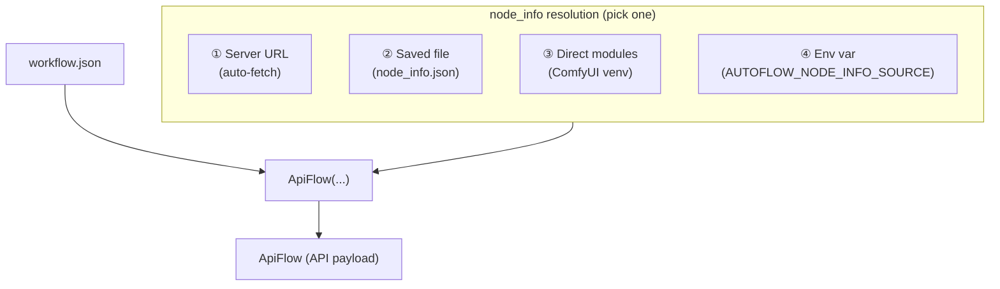
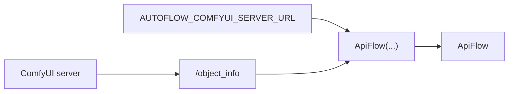

# NodeInfo + env vars

`NodeInfo` is the schema ComfyUI returns from `GET /object_info`. autoflow uses it to translate a workspace workflow into an API payload.

## How autoflow resolves `node_info`

There are 4 ways to provide node info. All produce the same result — a valid `ApiFlow` ready for editing or submission.



| # | Method | Code | Requires | Best for |
|---|--------|------|----------|----------|
| ① | **Server URL** | `ApiFlow("workflow.json")` | Running ComfyUI + env var | Day-to-day work |
| ② | **Saved file** | `ApiFlow("workflow.json", node_info="node_info.json")` | One-time server fetch | Offline / reproducible |
| ③ | **Direct modules** | `ApiFlow("workflow.json", node_info="modules")` | ComfyUI repo on `PYTHONPATH` | Serverless / CI |
| ④ | **Env var auto** | `ApiFlow("workflow.json")` + `AUTOFLOW_NODE_INFO_SOURCE` | Depends on value | Advanced / flexible |

---

### ① Server URL (most common)

Set `AUTOFLOW_COMFYUI_SERVER_URL` once and node_info is auto-fetched from your running ComfyUI server. No explicit `node_info=` needed.



```bash
# Set once (Linux/macOS)
export AUTOFLOW_COMFYUI_SERVER_URL="http://localhost:8188"
```

```python
# api
import os
from autoflow import ApiFlow

os.environ["AUTOFLOW_COMFYUI_SERVER_URL"] = "http://localhost:8188"
api = ApiFlow("workflow.json")
api.save("workflow-api.json")
```

---

### ② Saved file (offline / reproducible)

Fetch `node_info.json` once from a server, then convert offline without any server running.

**Step 1: Save `node_info.json` (one-time)**


```python
# api
from autoflow import NodeInfo

# Fetch from server and save in one call
NodeInfo.fetch(server_url="http://localhost:8188", output_path="node_info.json")
```

```bash
# cli
python -m autoflow --download-node-info-path node_info.json --server-url http://localhost:8188
```

**Step 2: Convert offline (no server needed)**

```python
# api
from autoflow import ApiFlow

api = ApiFlow("workflow.json", node_info="node_info.json")
api.save("workflow-api.json")
```

```bash
# cli
python -m autoflow --input-path workflow.json --output-path workflow-api.json --node-info-path node_info.json
```

---

### ③ Direct modules (no server at all)

If you're in a ComfyUI environment (repo + venv), build node_info from local Python modules — no server process needed.

> [!NOTE]
> Requires ComfyUI's Python modules to be importable (same venv/conda env, ComfyUI repo root on `PYTHONPATH`).

```python
# api
from autoflow import ApiFlow

api = ApiFlow("workflow.json", node_info="modules")
api.save("workflow-api.json")
```

You can also build a `NodeInfo` object directly:

```python
# api
from autoflow import NodeInfo

oi = NodeInfo.from_comfyui_modules()
# Equivalent shorthand:
oi = NodeInfo("modules")
```

Related: [Serverless execution](execute.md)

---

### ④ Env var auto-resolution (`AUTOFLOW_NODE_INFO_SOURCE`)

Set `AUTOFLOW_NODE_INFO_SOURCE` to auto-resolve node_info when none is explicitly provided.

```bash
# Use server fetch (most common auto mode)
export AUTOFLOW_NODE_INFO_SOURCE=fetch

# Or use local modules
export AUTOFLOW_NODE_INFO_SOURCE=modules

# Or use a saved file
export AUTOFLOW_NODE_INFO_SOURCE=/path/to/node_info.json
```

```python
# api
from autoflow import ApiFlow

# node_info resolved automatically from AUTOFLOW_NODE_INFO_SOURCE
api = ApiFlow("workflow.json")
```

Supported values:

| Value | Behavior |
|-------|----------|
| `fetch` | Use `server_url` / `AUTOFLOW_COMFYUI_SERVER_URL` if set; otherwise fall back to modules |
| `modules` | Use local ComfyUI modules (`NodeInfo.from_comfyui_modules()`) |
| `server` | Require `server_url` / `AUTOFLOW_COMFYUI_SERVER_URL`; error if missing |
| file path | Load from the specified `node_info.json` file |

---

## NodeInfo API

| Method | Description |
|--------|-------------|
| `NodeInfo.fetch(server_url=, timeout=, output_path=)` | Fetch from ComfyUI server |
| `NodeInfo().fetch(server_url=, timeout=)` | Fetch and **mutate in-place** (returns `self`) |
| `NodeInfo.load(path_or_json_str)` | Load from file or JSON string |
| `NodeInfo.from_comfyui_modules()` | Build from local ComfyUI Python modules |
| `NodeInfo("modules")` | Shorthand for `from_comfyui_modules()` |
| `.save(path)` | Write to disk |
| `.to_json()` | Serialize to JSON string |

## Polymorphic inputs

autoflow normalizes `node_info` inputs through a shared resolver, so you can pass:
- a dict-like `NodeInfo` object
- a file path (`str` or `Path`)
- a URL
- `"modules"` / `"from_comfyui_modules"` for direct module loading

Server URLs are normalized the same way: empty strings are treated as missing, and
`AUTOFLOW_COMFYUI_SERVER_URL` is used when `server_url` is omitted.

## Optional env vars (defaults)

These env vars override library defaults (precedence is always: args → env → default):

| Env var | Type | Meaning |
|--------|------|---------|
| `AUTOFLOW_COMFYUI_SERVER_URL` | str | Default ComfyUI server URL |
| `AUTOFLOW_NODE_INFO_SOURCE` | str | Source for `node_info`: `fetch`, `modules`, `server`, or file path |
| `AUTOFLOW_TIMEOUT_S` | int | Default HTTP timeout seconds |
| `AUTOFLOW_POLL_INTERVAL_S` | float | Poll interval for wait/poll loops |
| `AUTOFLOW_WAIT_TIMEOUT_S` | int | Default wait timeout seconds |
| `AUTOFLOW_SUBMIT_CLIENT_ID` | str | Default `client_id` for submit |
| `AUTOFLOW_SUBGRAPH_MAX_DEPTH` | int | Default max depth for subgraph flattening |
| `AUTOFLOW_FIND_MAX_DEPTH` | int | Default max depth for `flow.find(...)` / `flow.nodes.find(...)` recursion |

## Deprecated / experimental: model layer switch

autoflow currently supports an **internal** model implementation switch via an env var.

- This is **experimental** and may be removed before release.
- Only use it for local exploration/testing (don't depend on it in production code).

**Env var**: `AUTOFLOW_MODEL_LAYER`

- `AUTOFLOW_MODEL_LAYER=flowtree` (default): wrapper-based, terminal-first navigation layer
- `AUTOFLOW_MODEL_LAYER=models`: legacy-parity dict-subclass layer

Set it **before importing** `autoflow`:

```bash
# Linux/macOS
export AUTOFLOW_MODEL_LAYER=models

# Windows PowerShell
$env:AUTOFLOW_MODEL_LAYER = "models"

# Windows CMD
set AUTOFLOW_MODEL_LAYER=models
```


